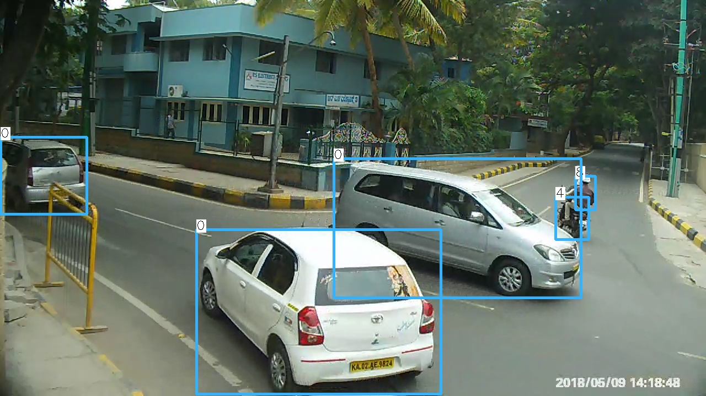
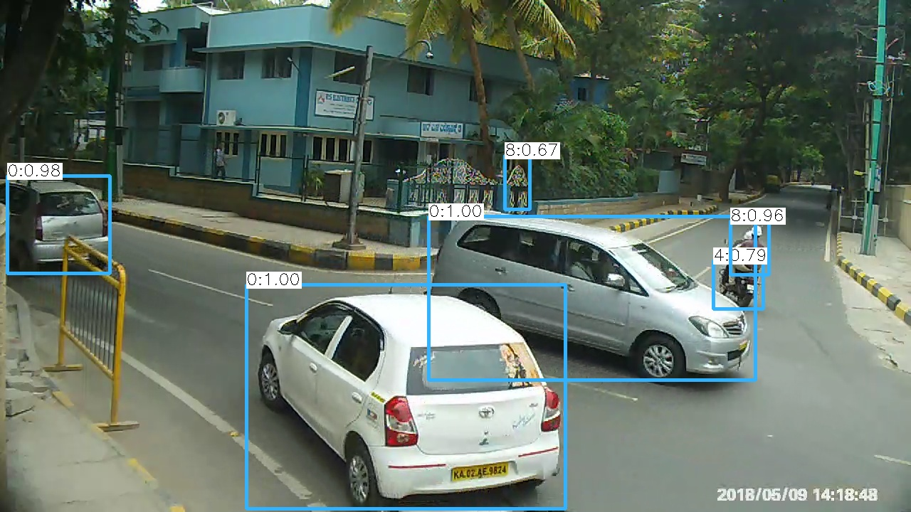

# Draw Bounding Boxes
A python script to draw bounding boxes on ground truth and detections for YOLO and VOC if bounding box outputs are saved in a text file.

## Sample Output

### Ground Truth

### Detection 

## Steps

1. Move the images into the images folder.
2. Have all the ground truth and detections saved in a text file with their names according to the image name of it.
3. Move the ground truth files  and the detection files in ground-truth-txt and detection-results-txt respectively.
4. Run main.py. 
5. The results are stored in ground-truth-BB and detection-results-BB.

## Notes - 
1. The code prints only class ids along with bounding boxes, if you want to print the class names instead, comment out lines 16, 36 and uncomment 17, 37, 75, 76, 78 and make sure you have a class_lists.txt in the following format. eg- classid 0 corresponds to car and classid 1 corresponds to 2-wheeler, the file should have -
line 1 - car
line 2 - 2-wheeler

2. If co-ordinates in VOC format, comment out lines 95, 96, 103, 106, and uncomment lines 97, 104.
